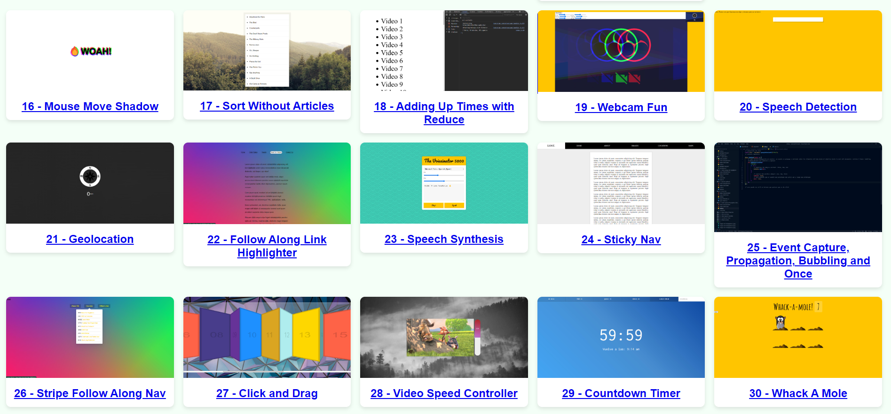

# Proyectos de JavaScript 30

Proyectos de JavaScript realizados como parte del reto JavaScript 30.  
Puede ver todos los proyectos desplegados aquí: https://sebasgrandes23.netlify.app/.

_Las prácticas principales realizadas son las de las carpetas enumeradas dentro de la carpeta "projects", ahí también hay apuntes principales._

Visita la [página del curso](https://javascript30.com/) para inscribirte.
